# Create and Connect to an Azure SQL Database

The next section of the workshop you will be creating and connecting to an Azure SQL Database.

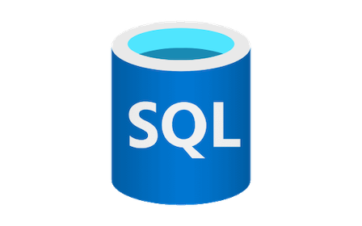

## Azure SQL Database create and connect workshop tasks

### Create a free Azure SQL Database

1. Ensure you have an Azure account to log into the Azure Portal. Need a free account? Sign up for one [here](https://azure.microsoft.com/en-us/free).

    **NOTE: (You can skip this step if you are using a Skillable VM instance)**

1. Navigate to the [Azure Portal](https://portal.azure.com/#home), and in the upper left corner, click the menu button.

    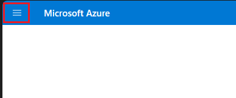

1. Then, select **Create a Resource**.

    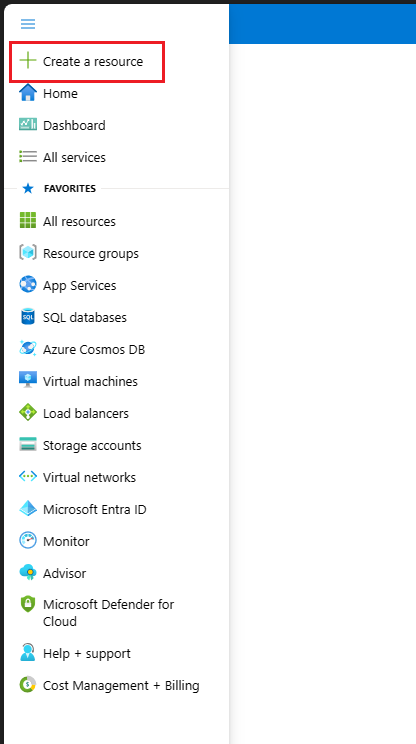

1. In the category menu, select **Databases**.

    

1. Then click **create** for **SQL Database**.

    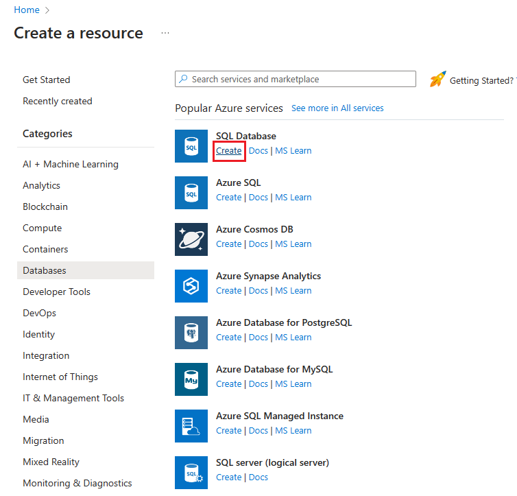

1. On the **Create SQL Database** page, click the **Apply offer (Preview)** button for the free Azure SQL Database.

    

1. In the **Project details** section of the page, select a subscription and a Resource group if you have an existing one. 

    

    Otherwise you can create a Resource group by clicking the **Create new** button.

    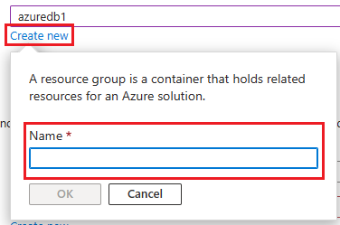

1. Next, in the **Database details** section of the page, name your database **freeDB** with the **Database name** field.

    

1. For the **Server**, click the **Create new** button.

    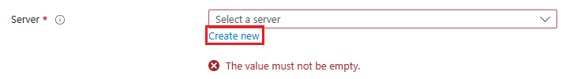

1. On the **Create SQL Database Server** page, enter a **server name** and choose a **Location** using the dropdown menu.

    

1. Now, in the **Authentication** section, select the **radio button** for **Use Microsoft Entra-only authentication**.

    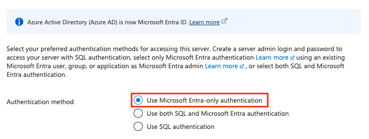

1. Click the **Set admin** link in the **Set Microsoft Entra admin** section. 

    

1. Using the **Microsoft Entra ID** blade, find your user account and select it as an admin. Then click the **Select** button on the bottom left.

    

1. Click the **OK** button on the bottom left of the page.

    

1. Back on the **Create a SQL Database** page, verify the values you entered and that the free database offer has been applied. 

    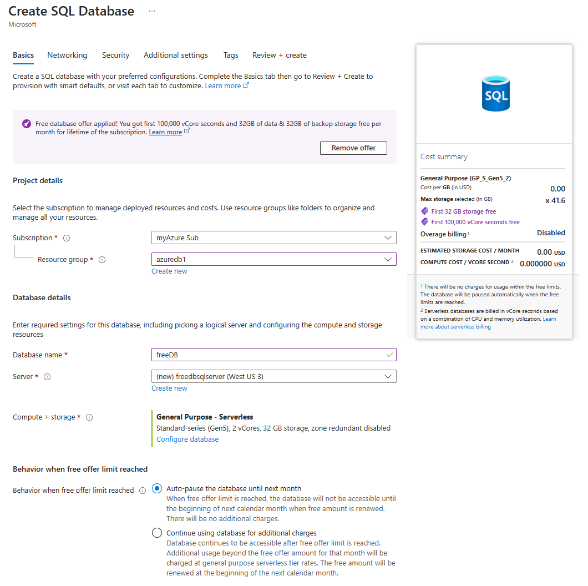

1. On the top of the page, click on the **Additional settings** tab.

    

1. On the Additional settings page, find the **Data source** section on the top.

    

1. Use the **Use existing data** toggle

    

    to set it to **Sample** by clicking on it.

    

    and in the pop-up dialog, select **OK** for the question **"Do you want to continue"**.

    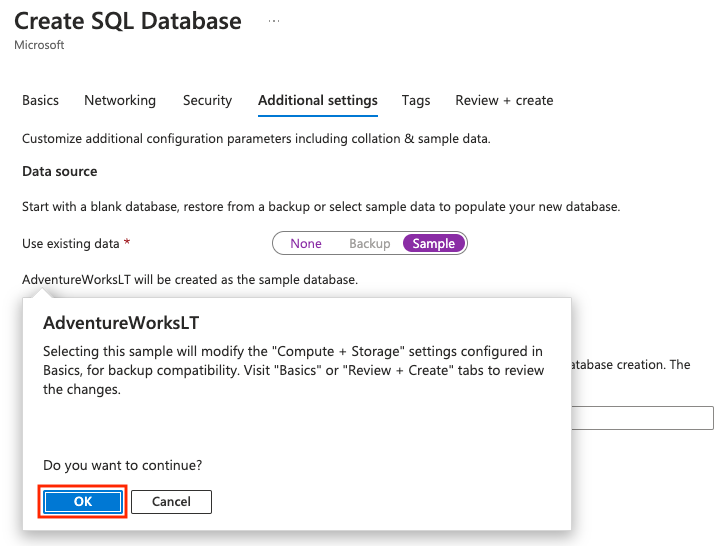

1. On the bottom of the page in the lower left, click the **Review + create** blue button.

    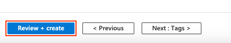

1. On the following page, click the **Create** button in the lower left.

    

1. The following page will detail the deployments progress. *(Deployment takes a minute or 2)*

    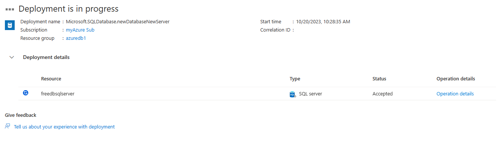

1. Once the deployment is done, click the blue **Go to resource** button to see your database details.

    

#### Network access to the database

1. On the database details page, the right hand side, you will see the **Server name** field with a link the your database server. Click the server name link.

    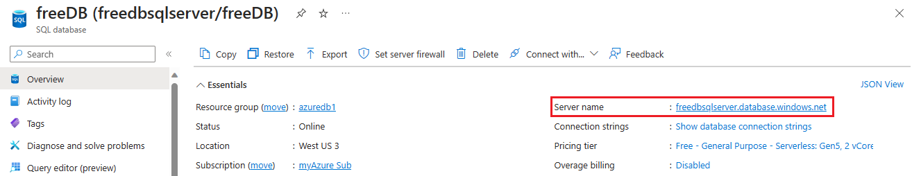

1. Click the **Networking** link on the left hand side menu in the **Security** section.

    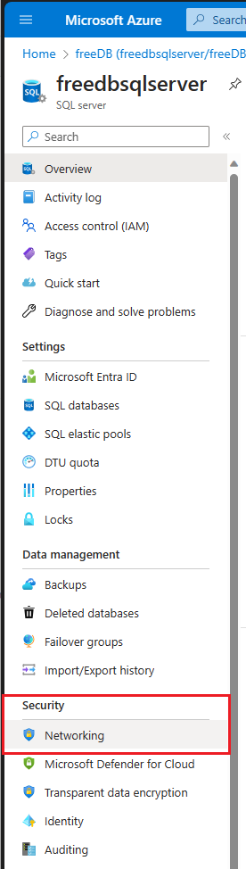

1. On the **Networking** page, click the **radio button** next to **Selected networks**.

    

1. In the **Firewall rules** section, click the button labeled **"Add your client IPv4 address (X.X.X.X)"** to add your local IP address for database access.

    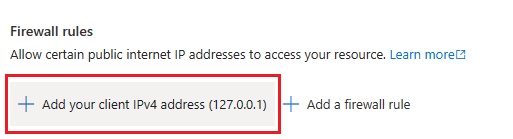

1. Finally, click the **Save** button in the lower left of the page.

    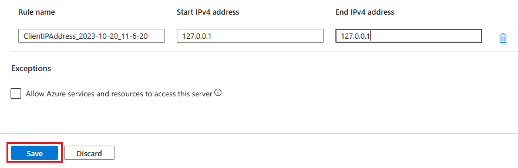

### Connect to the free Azure SQL Database

#### Using Visual Studio Code

Visual Studio Code will be used for working with the database.

1. Using the menu on the left side, open the menu items under **Settings** if not already opened. Then select **Azure SQL Databases** by clicking on it.

    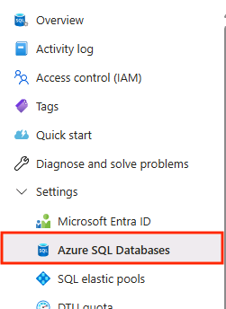

1. Next, on the main page, find the freeDB you created and click on it navigate to the database details page.

    

1. On the SQL Database overview page, **Getting Started** tab for the database details. Here click on the blue **Open in Visual Studio Code** button.

    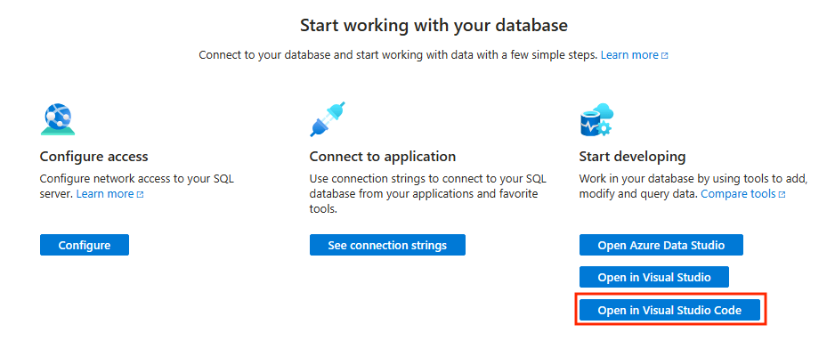

1. On the following page, if Visual Studio Code is not installed, click on the blue **Download Visual Studio Code** button to start that process. If it is already installed or was just installed, click on the **Launch it now** link.

    

1. After clicking **Launch it now**, the browser will have a modal window saying "This site is trying to open Visual Studio Code". Click the **Open** button.

    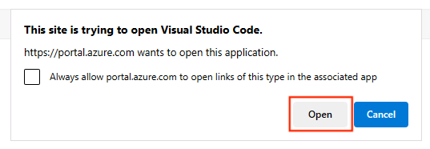

1. When Visual Studio Code opens, click the SQL Extension on the left side.

    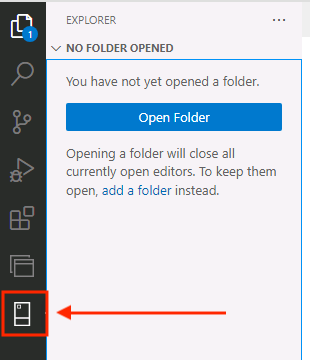

1. Next, click **Add Connection** in the SQL Extension.

    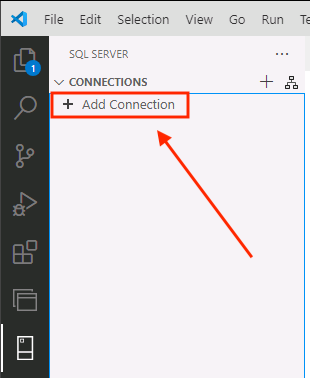

1. On the top of Visual Studio Code, a dialog box will appear asking for a **Server Name or ADO.NET connection string**.

    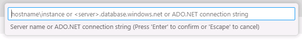

    Enter the **server name** of your Free Azure SQL Database instance. You can find and copy this value on the Azure SQL Database details page back in the Azure Portal.

    *You may have to click the X in the upper right corner of the "Start Modern Data Workflow in Visual Studio Code" Page to return to the SQL Overview page.*

    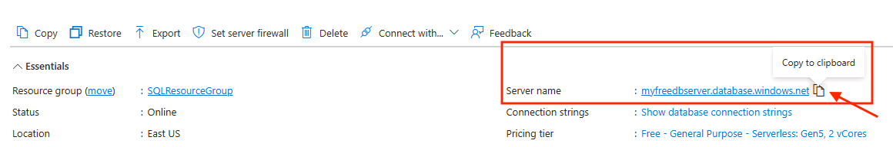

    then press enter/return in the dialog box.

1. The next dialog box asks for the **Database Name**. Enter **freeDB** (the name if the database you created) and press enter/return.

    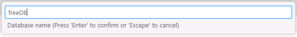

1. For the Authentication type dialog box, choose **Microsoft Entra Id**.

    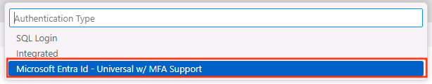

1. In the following dialog box, you are asked to **Choose a Microsoft Entra account**. Choose **Add a Microsoft Entra account...**. 

    

    and authenticate via Edge and the Azure portal.

    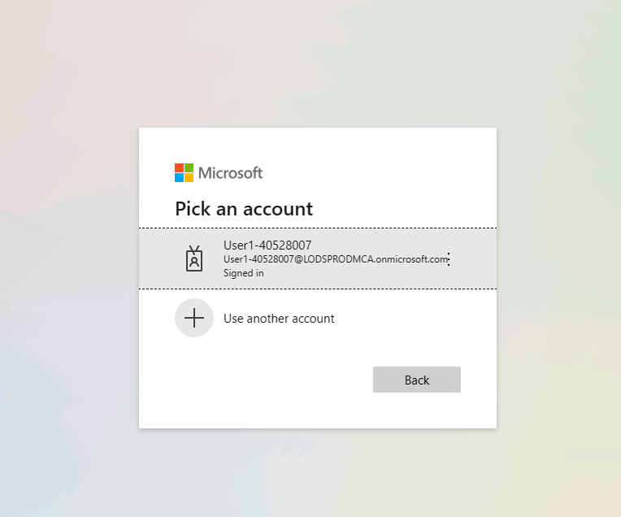

    Once authenticated, you can close the browser tab and return to Visual Studio Code.

    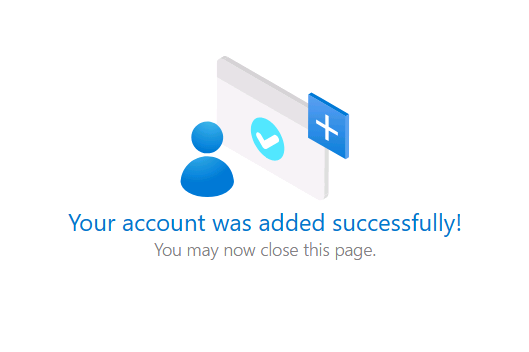

1. When you return to Visual Studio Code, the last dialog box asks you to **name the connection profile**. Name it **freeDB** and press enter/return.

   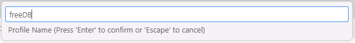

1. Once connected to the database, right click on the connection name in the connection navigator on the left side and choose **New Query**.

    

