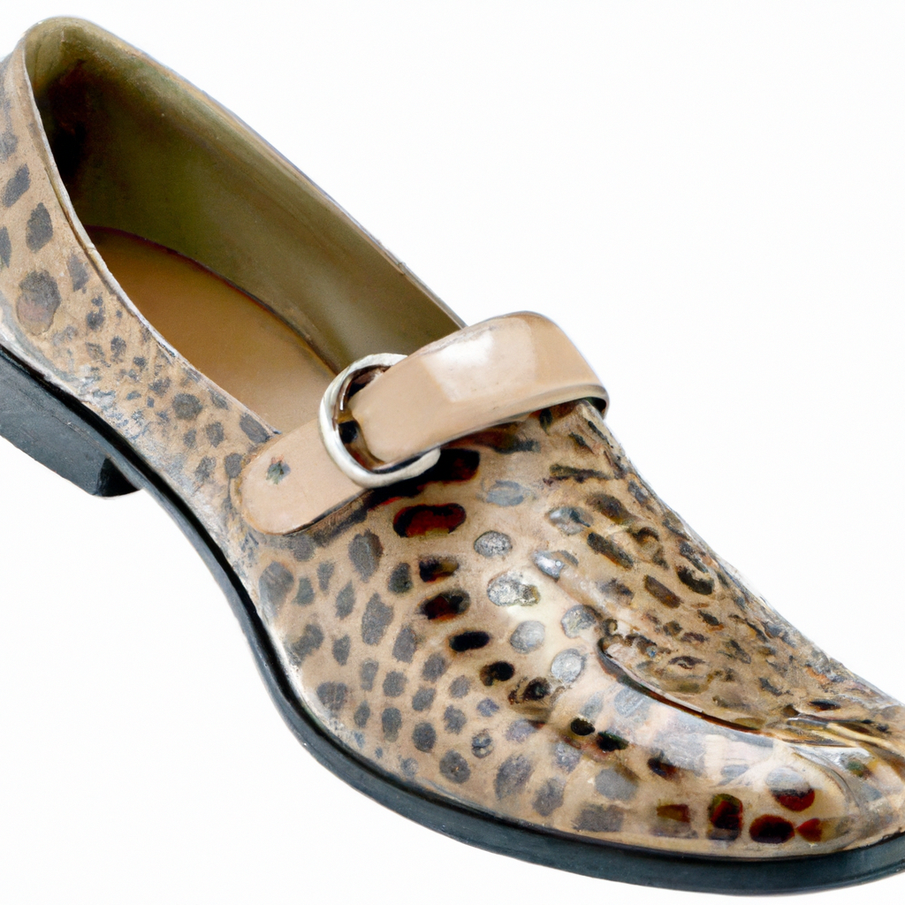

# Using Azure OpenAI Service

## Azure OpenAI DALL-E 3

The image generation API creates an image from a text prompt.

1. Copy the following SQL and paste it into the SQL query editor. Like the previous example, the query here 

```SQL
SELECT [Description] FROM [SalesLT].[ProductDescription] WHERE ProductDescriptionID = 457
``` 

returns a product description "**This bike is ridden by race winners. Developed with the Adventure Works Cycles professional race team, it has a extremely light heat-treated aluminum frame, and steering that allows precision control.**" which will be sent to the DALL-E 3 text to image endpoint.

    ```SQL
    declare @url nvarchar(max) = N'https://mlads.openai.azure.com/openai/deployments/mlads_dalle/images/generations?api-version=2024-05-01-preview';
    declare @headers nvarchar(300) = N'{"api-key": "OPENAI_KEY"}';
    declare @message nvarchar(max) = (SELECT [description] FROM [dbo].[walmart_product_details] WHERE id = 2);
    declare @payload nvarchar(max) = N'{
        "prompt": "' + @message + '",
        "size": "1024x1024",
        "n": 1
    }';

    select @message;

    declare @ret int, @response nvarchar(max);

    exec @ret = sp_invoke_external_rest_endpoint 
        @url = @url,
        @method = 'POST',
        @headers = @headers,
        @payload = @payload,
        @timeout = 230,
        @response = @response output;

    select @ret as ReturnCode, @response as Response;

    if (@ret=0)
        select json_value(@response, '$.result.data[0].url')
    ```

1. Replace the **OPENAI_KEY** text with the Azure OpenAI Key.

1. Execute the SQL statement with the run button.

    

1. Now, you are in charge. Either select a new product description ID or try creating an image yourself! Here is some inspiration:

    

## Azure OpenAI GPT-4o

Let's use the new GPT-4o model for this next call. We are going to ask it to describe a picture you make using the above DALL-E 3 endpoint. So to start, go wild and ask it to create you some fantastical image. Once you have that URL, we are going to use it in our REST call.

1. Copy the following SQL and paste it into the SQL query editor. 

    ```SQL
    declare @url nvarchar(4000) = N'https://mlads.openai.azure.com/openai/deployments/mladsgpt4o/chat/completions?api-version=2024-02-15-preview';
    declare @headers nvarchar(102) = N'{"api-key":"OPENAI_KEY"}';
    declare @payload nvarchar(max) = N'{
        "messages": [
            {
                "role": "system",
                "content": "You are an AI assistant that helps people find information."
            },
            {
                "role": "user",
                "content": [
                    {
                        "type": "text",
                        "text": "what is this an image of?"
                    },
                    {
                        "type": "image_url",
                        "image_url": {
                            "url": "DALLE3_IMAGE_URL"
                        }
                    }
                ]
            }
        ]
    }';
    declare @ret int, @response nvarchar(max);
    exec @ret = sp_invoke_external_rest_endpoint
    @url = @url,
    @method = 'POST',
    @headers = @headers,
    @payload = @payload,
    @timeout = 230,
    @response = @response output;
    select @ret as ReturnCode, @response as Response;
    ```
1. Replace the **OPENAI_KEY** text with the Model Deployment Key. Also, replace the **DALLE3_IMAGE_URL** with the url of the fantastical image you just created.

1. Execute the SQL statement with the run button.

1. View the return message and see if the new GPT-4o model was able to describe it.

    ```JSON
    "message": {
        "content": "This is an image of a bright green t-shirt with short sleeves. It has a small black graphic on the left chest area, which appears to be an abstract or stylized design. The neckline is round and there’s a hint of a tag visible through the collar. The hem at the bottom of the shirt also features a black trim.",
        "role": "assistant"
    }
    ```
